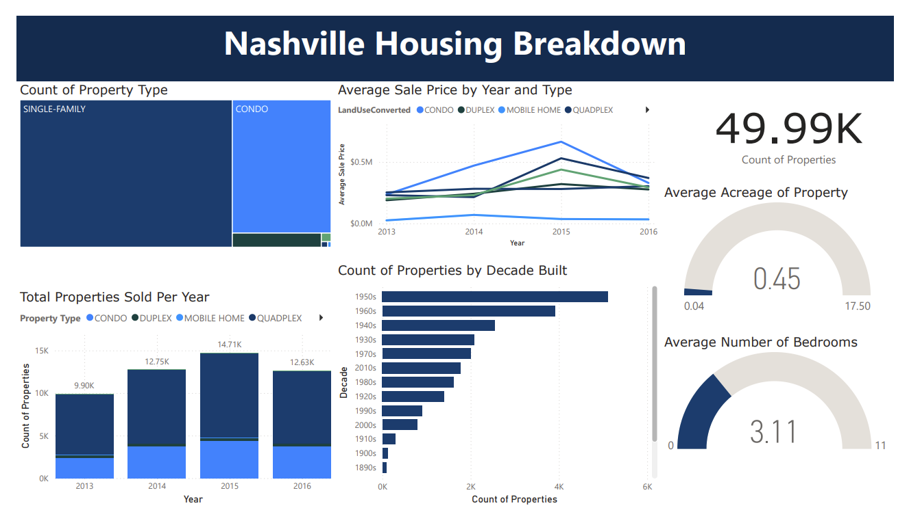

# Nashville Housing Analysis using SQL Server

This project demonstrates an end-to-end data analytics workflow using SQL Server and Power BI. Beginning with a raw housing dataset of more than 56,000 records, I cleaned, standardized, and transformed the data using SQL before building an interactive Power BI dashboard to explore housing prices, property characteristics, and historical market trends across Nashville, Tennessee.

The project focuses on practical data preparation techniques that improve data quality and usability for downstream analysis and visualization.

## Data Source

The project uses a publicly available Nashville housing dataset obtained from Kaggle. The dataset contains property transaction records including sale price, location, property type, bedrooms, bathrooms, square footage, and sale dates. For more information about the original dataset, please refer to the Kaggle page where the dataset was obtained [Nashville Housing Data](https://www.kaggle.com/datasets/yohan313/nashville-housing-data)

## Project Features

The SQL Server project includes the following features:

- Cleaned and standardized inconsistent housing records using SQL Server.
- Parsed and separated text fields using SUBSTRING(), PARSENAME(), and string manipulation functions.
- Removed duplicate records using Common Table Expressions (CTEs).
- Standardized missing and inconsistent values using CASE expressions.
- Produced a clean analytical dataset suitable for visualization and downstream analysis.
- Designed an interactive Power BI dashboard summarizing housing characteristics and pricing trends.

## Visualization
To view the Power BI dashboard, you can check out the visualization by downloading the Power BI file from this repository.
